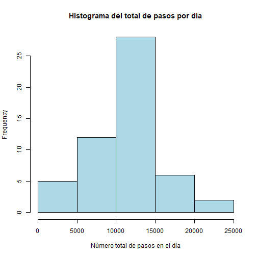
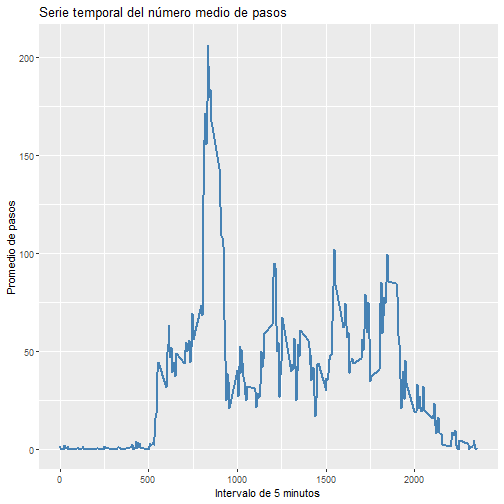
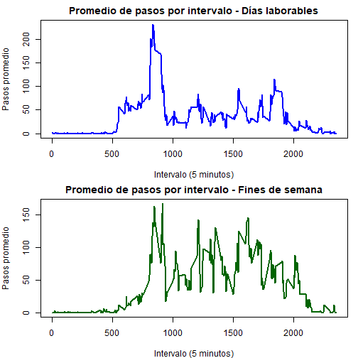

## 1) cargar los datos
Como primer paso de la tarea se requiere cargas los datos_raw, descomprimiendolos de su carpeta y asegurandonos de que la columna de fechas efectivamente sean fechas.

``` r
unzip("repdata_data_activity.zip")
datos_raw <- read.csv("activity.csv")
datos_raw$date <- as.Date(datos_raw$date)
library(ggplot2)
```
Luego se limpian los datos eliminando las filas que tienen NA (antes se verifican las dimensiones)

``` r
#Los datos tienen las dimensiones
dim (datos_raw)
```

```
## [1] 17568     3
```

``` r
#Limpieza de datos eliminando los casos incompletos (con NA)
datos_limpios<- datos_raw[complete.cases(datos_raw),]
```
##Histograma de pasos por día
### 2-1)Calcular los pasos por día
Primero hay que separar los pasos que se dan cada día, para esto se agregan según fecha y se utiliza la función de suma, de modo que la salida es un dataframe con fecha y total de pasos registrados ese día.

``` r
steps_por_dia <- aggregate(steps ~ date, data = datos_limpios, sum)
head(steps_por_dia)
```

```
##         date steps
## 1 2012-10-02   126
## 2 2012-10-03 11352
## 3 2012-10-04 12116
## 4 2012-10-05 13294
## 5 2012-10-06 15420
## 6 2012-10-07 11015
```
### 2-2)hacer el histograma
Una vez que se tiene la tabla anterior, se puede realizar el histograma

``` r
hist(steps_por_dia$steps,
     main = "Histograma del total de pasos por día",
     xlab = "Número total de pasos en el día",
     col = "lightblue",
     border = "black")
```


## 3)Calcular la media y la mediana de los pasos por día
Se calculan la media y la mediana y se muestran.

``` r
media_pasos <- mean(steps_por_dia$steps)
mediana_pasos <- median(steps_por_dia$steps)
media_pasos
```

```
## [1] 10766.19
```

``` r
mediana_pasos
```

```
## [1] 10765
```

## 4)Graficar la serie temporal del numero medio de pasos
Ahora se separan los pasos por intervalo y se calcula el promedio para cada uno, su grafico nos da la serie temporal del numero medio de pasos.

``` r
steps_por_intervalo <- aggregate(steps ~ interval, data = datos_limpios, mean)
head(steps_por_intervalo)
```

```
##   interval     steps
## 1        0 1.7169811
## 2        5 0.3396226
## 3       10 0.1320755
## 4       15 0.1509434
## 5       20 0.0754717
## 6       25 2.0943396
```

``` r
ggplot(steps_por_intervalo, aes(x = interval, y = steps)) +
  geom_line(color = "steelblue", size = 1) +
  labs(title = "Serie temporal del número medio de pasos",
       x = "Intervalo de 5 minutos",
       y = "Promedio de pasos")
```


## 5) Encontrar el intervalo que en promedio tiene más pasos

``` r
max_intervalo <- steps_por_intervalo[which.max(steps_por_intervalo$steps), ]
max_intervalo
```

```
##     interval    steps
## 104      835 206.1698
```
## 6) Llenar los datos que faltan
La lógica para llenar los datos que faltan será tomar el promedio de los 5 intervalos anteriores y posteriores del valor faltante.
Excepto que tenga un período muy grande y por lo cual no se pueda llenar.

### 6-1) Promedio por intervalo en todo el dataset

``` r
interval_means <- aggregate(steps ~ interval, data = datos_raw, FUN = mean, na.rm = TRUE)
mean_by_interval <- setNames(interval_means$steps, interval_means$interval)
```
### 6-2) Función de imputación híbrida día a día

``` r
imputar_hibrido_mismo_dia <- function(df, k = 5, mean_by_interval) {
  # df: data.frame de un único día (misma fecha), ordenado por 'interval'
  x <- df$steps
  n <- length(x)
  out <- x
  
  for (i in seq_len(n)) {
    if (is.na(x[i])) {
      # ventana [i-k, i+k] acotada a los bordes del día
      i1 <- max(1, i - k)
      i2 <- min(n, i + k)
      idx <- setdiff(i1:i2, i)
      vec <- x[idx]
      m <- mean(vec, na.rm = TRUE)
      
      # si no hay vecinos válidos, usar el promedio global de ese intervalo
      if (is.nan(m)) {
        m <- mean_by_interval[as.character(df$interval[i])]
      }
      out[i] <- m
    }
  }
  
  df$steps <- out
  df
}
```
## 6-3) Aplicar por fecha y recombinar

``` r
datos_na <- datos_raw[order(datos_raw$date, datos_raw$interval), ]
lista_por_dia     <- split(datos_na, datos_na$date)
lista_imputada    <- lapply(lista_por_dia, imputar_hibrido_mismo_dia, k = 5, mean_by_interval = mean_by_interval)
datos_imputados   <- do.call(rbind, lista_imputada)
row.names(datos_imputados) <- NULL

## 6-4) Verificación
cat("NAs antes:", sum(is.na(datos_raw$steps)),
    " | NAs después:", sum(is.na(datos_imputados$steps)), "\n")
```

```
## NAs antes: 2304  | NAs después: 0
```

``` r
## 6-5)Totales diarios imputados
steps_por_dia_imputado <- aggregate(steps ~ date, data = datos_imputados, sum)

## 7) Histograma con datos imputados
hist(steps_por_dia_imputado$steps,
     main   = "Histograma del total de pasos por día (datos imputados)",
     xlab   = "Número total de pasos en el día",
     ylab   = "Frecuencia de días",
     col    = "lightblue",
     border = "black")
```


## 7-2) Calcular la media y la mediana de lso pasos por día

``` r
media_pasos_imputados <- mean(steps_por_dia_imputado$steps)
mediana_pasos_imputados <- median(steps_por_dia_imputado$steps)
media_pasos_imputados
```

```
## [1] 10766.19
```

``` r
mediana_pasos_imputados
```

```
## [1] 10766.19
```
## 7-3) Comparación con los datos sin imputar (error en %)

``` r
error_media <- (media_pasos - media_pasos_imputados)*100/media_pasos_imputados
error_mediana <- (mediana_pasos- mediana_pasos_imputados)*100/mediana_pasos_imputados
error_media
```

```
## [1] 0
```

``` r
error_mediana
```

```
## [1] -0.01104085
```
## 8)Comparar días laborales con no laborales

## 8-1) Separar dás laborales de no laborales

``` r
datos_imputados$date <- as.Date(datos_imputados$date)
datos_imputados$daytype <- ifelse(weekdays(datos_imputados$date) %in% c("sábado", "domingo"),
                                  "weekend", "weekday")
```
## 8-2) Calcular promedios por intervalo y tipo de día

``` r
steps_por_intervalo <- aggregate(steps ~ interval + daytype,
                                 data = datos_imputados, mean)
```
## 8-3) Graficar

``` r
par(mfrow = c(2,1), mar = c(4,4,2,1))

with(subset(steps_por_intervalo, daytype == "weekday"),
     plot(interval, steps, type = "l", col = "blue", lwd = 2,
          main = "Promedio de pasos por intervalo - Días laborables",
          xlab = "Intervalo (5 minutos)",
          ylab = "Pasos promedio"))

with(subset(steps_por_intervalo, daytype == "weekend"),
     plot(interval, steps, type = "l", col = "darkgreen", lwd = 2,
          main = "Promedio de pasos por intervalo - Fines de semana",
          xlab = "Intervalo (5 minutos)",
          ylab = "Pasos promedio"))
```



``` r
par(mfrow = c(1,1))  # reset layout
```
